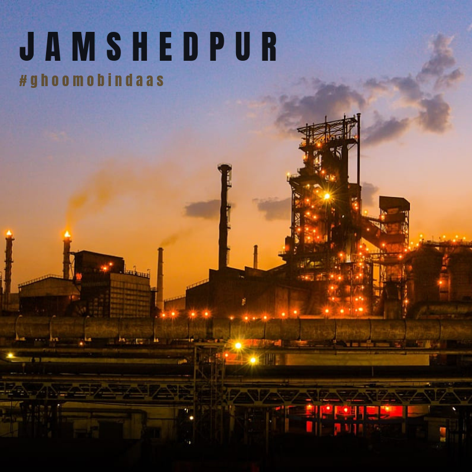

# 🌟 EcoSync - Jamshedpur 🌿

[](https://react.dev/)
[](https://nodejs.org/)
[](https://www.mongodb.com/)
[](https://deepmind.google/technologies/gemini/)

EcoSync is a next-generation, smart municipal waste management and recycling platform tailored specifically to bridge the civic gap in **Jamshedpur, Jharkhand**. Built as a final year engineering project, it enables real-time collaboration between citizens, municipal administrators, and waste collection drivers.

---

## 📸 City Banner



---

## ✨ Features

### 👤 Citizen Portal
- **Geocoded Waste Reporting**: Report overflowing garbage piles, illegal dumps, or litter by uploading photos. The app captures coordinates and links them to the report.
- **AI-Powered Waste Analysis**: Integrates the **Google Gemini API** to analyze uploaded waste pictures, categorize waste types, and provide recycling recommendations.
- **Eco-Rewards & Calculator**: Earn points for eco-friendly actions and track your standing on the Jamshedpur Leaderboard.
- **Real-Time Tracking (My Cases)**: View the current status (Pending, In Progress, Resolved) of your filed reports.

### 🚛 Driver Portal
- **Assigned Pickups**: Drivers receive a localized list of pickups assigned to their route.
- **Status Updates**: Instantly mark pickups as collected and notify the citizen.

### 👑 Admin Control Center
- **Interactive Command Center**: Track all active cases, pending requests, and collection rates across Jamshedpur.
- **Driver Dispatch**: Manually assign and dispatch collection drivers to reports based on location.
- **Broadcast Announcements**: Send city-wide or ward-specific alerts, collection schedules, and announcements.

---

## 🛠️ Tech Stack

### Frontend
- **Framework**: React.js (built with Vite)
- **Styling**: Tailwind CSS
- **Animations**: Framer Motion (for fluid, glassmorphic UI transitions)
- **Icons**: Lucide React

### Backend
- **Server**: Node.js & Express
- **Database**: MongoDB Atlas (configured with Mongoose ODM)
- **Image Processing**: Multer & Cloudinary SDK (for cloud storage of verification photos)
- **AI Engine**: Google Gen AI (Gemini API)
- **Authentication**: JSON Web Token (JWT) & bcryptjs (password hashing)

---

## 🚀 Getting Started

### Prerequisites
Make sure you have [Node.js](https://nodejs.org/) (v18+) and [Git](https://git-scm.com/) installed on your machine.

---

### Installation & Configuration

#### 1. Clone the repository
```bash
git clone https://github.com/codewithganeshhh/Ecosync.git
cd Ecosync
```

#### 2. Configure the Backend
Go into the `backend/` folder and create a `.env` file:
```bash
cd backend
touch .env # on Windows: type NUL > .env
```

Add the following environment variables:
```env
NODE_ENV=development
PORT=5000
MONGO_URI=your_mongodb_connection_string
JWT_SECRET=your_jwt_secret_token

CLOUDINARY_CLOUD_NAME=your_cloudinary_cloud_name
CLOUDINARY_API_KEY=your_cloudinary_api_key
CLOUDINARY_API_SECRET=your_cloudinary_api_secret

GEMINI_API_KEY=your_google_gemini_api_key
```

Install backend dependencies and run the server:
```bash
npm install
npm run dev
```

#### 3. Configure the Frontend
Open a new terminal window, go into the `frontend/` folder, and create a `.env` file:
```bash
cd ../frontend
touch .env # on Windows: type NUL > .env
```

Add the following environment variables:
```env
VITE_API_URL=http://localhost:5000/api
```

Install frontend dependencies and start the client:
```bash
npm install
npm run dev
```

---

## 👥 Meet the Innovators

- **Ganesh** — *Lead Full-Stack Developer* (Architected core backend, Cloudinary pipeline, and database models)
- **Project Partner 1** — *Frontend & UI/UX Specialist* (Designed glassmorphism pages and Framer Motion transitions)
- **Project Partner 2** — *Database & Backend Engineer* (Configured authentication and driver trackers)
